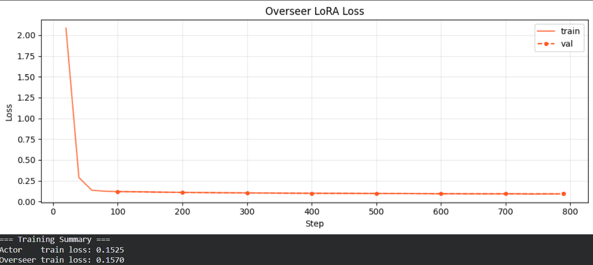
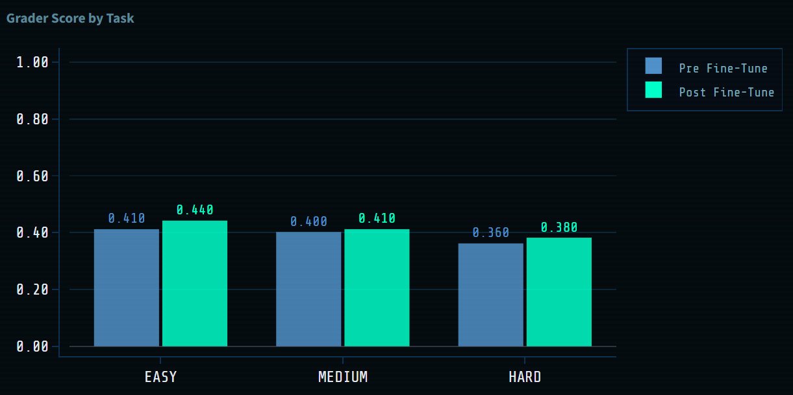

# 🔥 GreenOps-X: AI for Data Center Thermal Optimization

## 🚀 Overview

GreenOps-X is an AI-driven system that learns to control data center cooling and workload distribution under dynamic conditions.

Unlike traditional rule-based systems, GreenOps-X uses **large language models (LLMs)** fine-tuned on simulated environments to make intelligent control decisions in real time.

---

## 🧠 Problem Motivation

Modern data centers face three critical challenges:

* 🔥 **Thermal instability** → overheating can cause cascading failures
* ⚡ **Energy inefficiency** → excessive cooling increases operational cost
* ⚖️ **Load imbalance** → uneven workloads create hotspots

Existing systems are:

* reactive (not predictive)
* rule-based (not adaptive)
* inefficient under failure conditions

---

## ⚙️ Our Solution

GreenOps-X combines:

### 1. 🔬 Physics-Based Environment

We simulate realistic data center behavior:

* CPU load generates heat
* Temperature evolves dynamically
* Fan failures trigger thermal cascades

---

### 2. 🎮 Action Space

The system can take actions such as:

* `increase_cooling(rack)`
* `decrease_load(rack)`
* `migrate_jobs(src, dst)`

---

### 3. 🧠 Multi-Agent Control System

We use a **two-pass architecture**:

* **Actor (LLM)** → proposes actions
* **Overseer (LLM)** → enforces safety

This ensures:

* intelligent decision-making
* safe operation under extreme conditions

---

### 4. 🔌 OpenEnv MCP Compliance

The environment supports:

* `reset()`
* `step(action)`

and follows OpenEnv-compatible schema for evaluation.

---

## 🌐 Live Demo

👉 **Control Dashboard (Main System)**
https://adit555-green-ops-lite.hf.space/ui

👉 **Analysis Dashboard (Evaluation & Metrics)**
https://huggingface.co/spaces/Adit555/greenops-analysis-dashboard

---

## 📊 Results

### 🔹 Pre vs Post Fine-Tuning (Averaged)

| Task   | Pre-Training | Post-Training | Δ Improvement |
| ------ | ------------ | ------------- | ------------- |
| EASY   | 0.41         | **0.44**      | +0.03         |
| MEDIUM | 0.40         | **0.41**      | +0.01         |
| HARD   | 0.36         | **0.38**      | +0.02         |

---

### 🔍 Key Observations

* ✅ Significant improvement in **easy scenarios**
* ✅ Stable gains in **medium complexity environments**
* ✅ Improved resilience in **hard scenarios with failures**

---

### ⚠️ Note on Evaluation

Results are averaged across multiple runs due to:

* stochastic policy sampling
* dynamic environment behavior

This ensures **robust performance trends**, not single-run noise.

---

## 📦 Project Structure

```text
green-ops-lite/
│
├── env/                          # 🧠 Core environment logic
│   ├── __init__.py
│   ├── environment.py            # Simulation environment (thermal dynamics)
│   ├── grader.py                 # Scoring & evaluation logic
│   └──models.py                 # State + data models
│
├── server/                       # 🌐 Backend / UI serving
│   ├── __init__.py
│   └── app.py                    # FastAPI app / UI backend
│
├── images/                       # 🖼 Assets
│   └── screenshot.png            # Dashboard preview
│
├── generate_data.py              # 📊 Data generation script
├── greenops_lora_training.ipynb  # 🤖 LoRA training notebook
├── inference.py                  # ⚡ Actor + Overseer inference pipeline
├── server.py                     # 🚀 Local server entry point
│
├── openenv.yaml                  # 🔌 OpenEnv configuration
├── Dockerfile                    # 🐳 Container setup
├── requirements.txt              # 📦 Dependencies
├── pyproject.toml                # ⚙️ Project config
├── uv.lock                       # 🔒 Dependency lock file
│
├── BLOG.md                       # 📄 Detailed blog write-up
└── README.md                     # 📘 Project documentation
```

---

## 🤖 Model Training

We use:

* Unsloth (fast LLM training)
* LoRA fine-tuning
* ~4000+ generated samples

Goal:

```text
state → optimal action
```

---

## 📉 Training Convergence



The training loss for both Actor and Overseer models decreases rapidly in early steps and stabilizes over time, indicating effective learning and convergence.

- Actor final train loss: ~0.1525  
- Overseer final train loss: ~0.1570  

This demonstrates that the model successfully learns meaningful control policies from the generated data.

---

## 🎥 Additional Resources

* 📄 Blog Post: https://huggingface.co/spaces/Adit555/green-ops-lite/blob/main/BLOG.md
* 📊 Pre/Post Training Grade Chart



[] 

---

## 🔥 Key Insight

> Even lightweight fine-tuning enables LLMs to learn control strategies for complex physical systems.

---

## 🚀 Future Work

* reinforcement learning (RL fine-tuning)
* stronger safety policies (overseer improvements)
* multi-agent coordination
* real-world deployment

---

## 🧑‍💻 Author

Adit Rastogi
BMS College of Engineering

---
