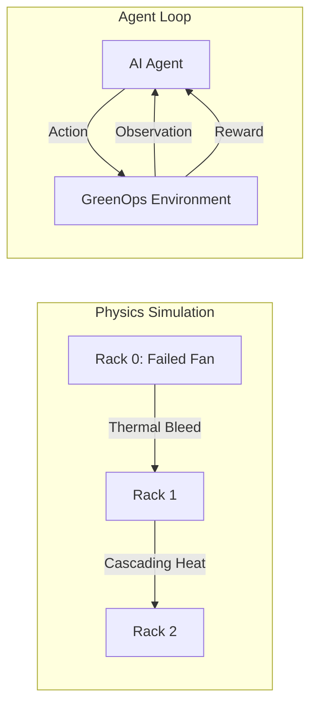

---

title: A multi-objective reinforcement learning environment for optimizing data center energy efficiency and reliability.
emoji: 🌱
colorFrom: green
colorTo: blue
sdk: docker
app_file: app.py
app_port: 7860
pinned: false
-------------

# 🌱 Green-Ops Lite: Intelligent Data Center Optimization Environment

> 🚀 A physics-inspired reinforcement learning environment that models real-world data center failures, enabling AI agents to optimize energy, stability, and uptime under cascading thermal constraints.

## 🚀 Overview

**Green-Ops Lite** is an OpenEnv-compliant simulation environment for training AI agents to manage **energy-efficient and reliable data center operations**.

It models real-world infrastructure challenges where systems must balance:

* 🔥 Thermal stability
* ⚡ Energy efficiency
* 🖥️ System uptime

Unlike toy RL environments, Green-Ops Lite introduces **physics-inspired dynamics and multi-objective optimization**, making it closer to real production systems.

---

## 🎯 Why This Matters

Modern AI infrastructure consumes massive energy. Efficient cooling and workload distribution are critical for:

* Reducing operational costs
* Preventing hardware failures
* Improving sustainability

> This project simulates real-world **SRE + Green AI decision-making** under constraints.

---

## 🧠 System Architecture



---

## 🧩 Environment Design

### 📊 State (Observation)

```json
{
  "rack_temp": [float, float, float],
  "cpu_load": [float, float, float],
  "power_cost": float,
  "failed_fan": bool,
  "step_count": int
}
```

---

### ⚙️ Action Space

```
increase_cooling(i)
decrease_load(i)
migrate_jobs(i, j)
```

---

## 🔥 Physics-Inspired Dynamics (Key Highlight)

Green-Ops Lite goes beyond linear environments:

### ✅ Non-linear thermal behavior

* Heat increases with load
* **Exponential thermal runaway** at high temperatures

### ✅ Cascading failures

* Fan failure in Rack 0 → heat spreads to Rack 1
* Creates real-world **failure propagation**

### ✅ Trade-offs

* Cooling reduces temperature but increases power cost
* Load balancing reduces hotspots but impacts throughput

---

## 🧪 Tasks & Difficulty

| Level     | Description                       |
| --------- | --------------------------------- |
| 🟢 Easy   | Stable system, basic cooling      |
| 🟡 Medium | Requires balancing load + cooling |
| 🔴 Hard   | Fan failure + cascading heat      |

---

## 🧠 Reward Function

Multi-objective optimization:

```
Reward = 0.45 × Stability 
       + 0.30 × Uptime 
       + 0.25 × Efficiency
```

### Signals:

* Penalizes overheating (>90°C)
* Rewards balanced cooling
* Encourages energy efficiency

---

## 🤖 Hybrid Baseline Agent

A **robust hybrid agent** combining:

### 🔹 LLM Reasoning

* Interprets system state
* Suggests actions

### 🔹 Rule-Based Safety Layer

* Prevents catastrophic decisions
* Handles edge cases reliably

> This design ensures **robust performance even if LLM fails**

---

### **"Baseline Agent Performance"**

```text
Easy   → 0.41+
Medium → 0.40+
Hard   → 0.32+
```

### Key Insights:

* ✅ Stable across all tasks
* ✅ Handles cascading failures
* ✅ Balances efficiency + performance

---

## ⚙️ OpenEnv Compliance

* ✔ reset()
* ✔ step()
* ✔ typed observations
* ✔ deterministic grading
* ✔ Docker-ready deployment

---

## 🚀 How to Run

### 1. Install

```bash
pip install -r requirements.txt
```

### 2. Set environment variables

```bash
API_BASE_URL=<endpoint>
MODEL_NAME=<model>
HF_TOKEN=<api_key>
```

### 3. Run

```bash
python inference.py
```

---

## 🐳 Docker

```bash
docker build -t greenops .
docker run greenops
```

---

## 🌍 Real-World Impact

This environment simulates challenges faced by:

* Hyperscale cloud providers
* AI infrastructure teams
* SRE / DevOps engineers

### Enables research in:

* Energy-aware AI agents
* Autonomous infrastructure control
* Sustainable computing

---

## 💡 Key Contributions

* Multi-objective RL benchmark for infrastructure
* Physics-inspired thermal modeling
* Cascading failure simulation
* Hybrid AI + control system design
* Robust evaluator-compliant implementation

---

## 🏁 Conclusion

Green-Ops Lite bridges the gap between:

* Reinforcement learning research
* Real-world infrastructure optimization

It provides a **practical, scalable benchmark** for building intelligent systems that operate under real-world constraints.

---

## 📬 Contact

**Adit Rastogi**
📧 [aditrastogi11@gmail.com](mailto:aditrastogi11@gmail.com)

---

## 🙌 Acknowledgements

* Meta AI Hackathon
* Hugging Face OpenEnv

---
