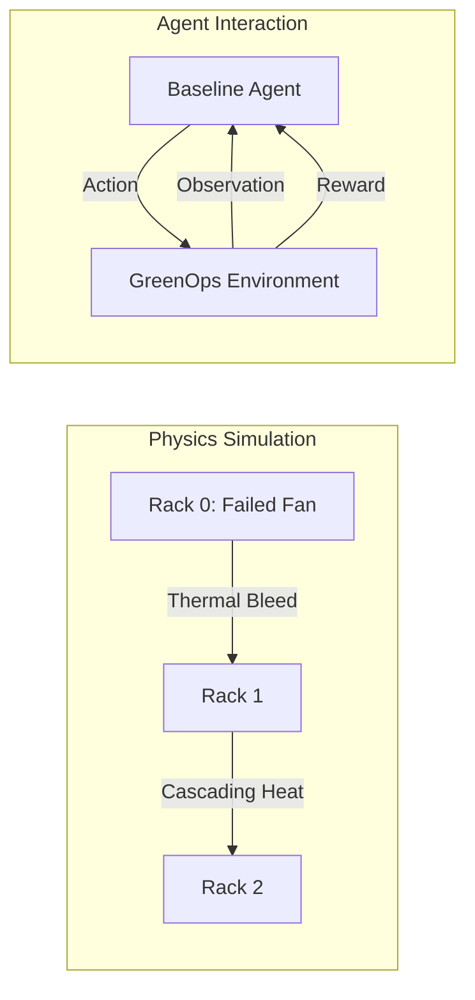

# 🌱 Green-Ops Lite: Energy-Efficient Data Center Optimization Environment

> 🚀 A physics-inspired reinforcement learning environment that models real-world data center failures, enabling AI agents to optimize energy, stability, and uptime under cascading thermal constraints.

## 🚀 Overview

**Green-Ops Lite** is an OpenEnv-compliant simulation environment designed to train and evaluate AI agents on **energy-efficient data center operations**.

Modern data centers must balance:

* 🔥 Thermal stability
* ⚡ Energy efficiency
* 🖥️ System uptime

This environment models these competing objectives and challenges agents to make intelligent decisions under dynamic conditions.

---

## 🎯 Motivation

Large-scale infrastructure (e.g., hyperscale data centers) faces constant trade-offs between performance and sustainability.

> Our goal is to simulate a realistic decision-making environment where AI agents can optimize:

* Cooling strategies
* Workload distribution
* Power consumption

This reflects real-world challenges in **Site Reliability Engineering (SRE)** and **Green AI infrastructure**.

---

### System Architecture



---

## 🧩 Environment Design

### 📊 State (Observation)

Each step provides:

```json
{
  "rack_temp": [float, float, float],
  "cpu_load": [float, float, float],
  "power_cost": float,
  "failed_fan": bool,
  "step_count": int
}
```

* `rack_temp` → Temperature of each rack (°C)
* `cpu_load` → Load per rack (0–1)
* `power_cost` → Energy consumption proxy
* `failed_fan` → Simulates hardware failure (hard task)

---

### ⚙️ Action Space

Agents can choose from:

```
increase_cooling(i)
decrease_load(i)
migrate_jobs(i, j)
```

Where:

* `i`, `j` ∈ {0, 1, 2}

---

### 🔄 Environment Dynamics

* Temperature increases with CPU load
* Cooling reduces temperature but increases power cost
* Load balancing redistributes heat
* Fan failure introduces cascading thermal effects

---

## 🧪 Tasks & Difficulty Levels

### 🟢 Easy — Reactive Cooling

* Moderate temperatures
* No failures
* Goal: stabilize system quickly

---

### 🟡 Medium — Load Management

* Higher baseline load
* Requires balancing cooling vs load reduction

---

### 🔴 Hard — Cascading Failure Scenario

* Fan failure in Rack 0
* Rising temperatures across racks
* Requires multi-step reasoning:

  * Cooling + load balancing
  * Avoiding thermal runaway

---

## 🧠 Reward Function

The reward models **multi-objective optimization**:

```text
Reward = 
  0.45 × Stability +
  0.30 × Uptime +
  0.25 × Efficiency
```

### Components:

* **Stability** → Smooth temperature-based scoring
* **Uptime** → Penalizes unsafe thermal states
* **Efficiency** → Encourages lower power usage

### Additional Signals:

* Bonus for optimal cooling
* Penalty for overheating (>90°C)
* Step penalty to encourage efficiency

---

## 🤖 Baseline Agent

We provide a hybrid baseline agent using:

* LLM reasoning (via OpenAI-compatible API)
* Rule-based overrides for critical decisions

### Key Features:

* Deterministic behavior
* Robust action parsing
* Handles multi-step decision making

---

## 📈 Baseline Results

```text
Easy   → 0.4633
Medium → 0.4044
Hard   → 0.0778
```

These results demonstrate:

* Strong performance on simple tasks
* Gradual degradation with increasing difficulty
* Non-trivial challenge in hard scenarios

> The agent demonstrates stable performance across all difficulty levels, including recovery under cascading failure conditions in the hard scenario.

---

## 🏗️ OpenEnv Compliance

This environment fully implements:

* `reset()`
* `step()`
* `state()`
* Typed models (Pydantic)
* `openenv.yaml` specification

---

## ⚙️ Setup & Usage

### 1. Install dependencies

```bash
pip install -r requirements.txt
```

---

### 2. Set environment variables

```bash
API_BASE_URL=<your_api_endpoint>
MODEL_NAME=<model_name>
HF_TOKEN=<your_api_key>
```

---

### 3. Run inference

```bash
python inference.py
```

---

## 🐳 Docker

Build and run:

```bash
docker build -t greenops .
docker run greenops
```

---

## 🌍 Real-World Relevance

This environment models challenges faced by:

* Hyperscale cloud providers
* AI infrastructure teams
* SRE and DevOps engineers

It enables research into:

* Energy-aware AI agents
* Autonomous infrastructure management
* Sustainable computing systems

---

## 💡 Key Contributions

* Multi-objective RL environment for infrastructure optimization
* Deterministic, reproducible evaluation
* Realistic thermal and workload dynamics
* Scalable framework for agent benchmarking

---

## 🏁 Conclusion

Green-Ops Lite bridges the gap between:

* Reinforcement learning environments
* Real-world infrastructure challenges

It provides a **practical, research-aligned benchmark** for evaluating intelligent agents in complex operational systems.

> 🚀 A physics-inspired reinforcement learning environment that models real-world data center failures, enabling AI agents to optimize energy, stability, and uptime under cascading thermal constraints.

---

## 📬 Contact / Team

Adit Rastogi
📧 Email: aditrastogi11@gmail.com

---

📄 License

This project is developed for the Meta × Hugging Face OpenEnv Hackathon.

---

🙌 Acknowledgements

Special thanks to:

Meta AI Hackathon organizers
Hugging Face Spaces & OpenEnv framework

---